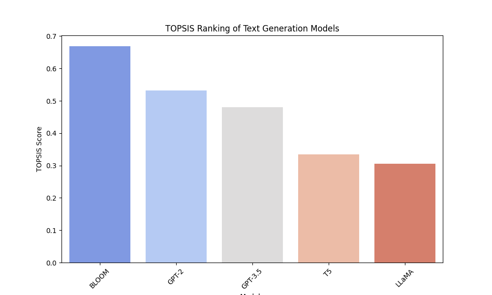

# topsis_text_generation
# TOPSIS for Text Generation Model Selection

## Overview
This project applies the **TOPSIS (Technique for Order of Preference by Similarity to Ideal Solution)** method to rank pre-trained **text generation models** based on their performance metrics.

## Models Evaluated
We compare the following models:
- **GPT-3.5**
- **GPT-2**
- **T5**
- **LLaMA**
- **BLOOM**

## Evaluation Criteria
The models are ranked based on the following criteria:
1. **Perplexity** (Lower is better)
2. **BLEU Score** (Higher is better)
3. **ROUGE Score** (Higher is better)
4. **Inference Time (s/token)** (Lower is better)
5. **Model Size (Billion parameters)** (Smaller is better)

## Methodology
1. **Data Collection**: We gather evaluation metrics for each model.
2. **Normalization**: Convert data to a comparable scale.
3. **Weight Assignment**: Assign importance weights to criteria.
4. **Compute Ideal Solutions**: Identify best and worst case scenarios.
5. **Calculate Euclidean Distances**: Compute distances to ideal and negative-ideal solutions.
6. **Compute TOPSIS Score**: Rank models based on closeness to the ideal solution.

## Results
The final rankings and scores are saved in `topsis_results.csv` and visualized in `topsis_ranking.png`.

### Final Rankings
| Rank | Model    | Perplexity | BLEU | ROUGE | Inference Time (s/token) | Model Size (B) | TOPSIS Score |
|------|---------|------------|------|-------|----------------------|------------|--------------|
| 1    | BLOOM   | 25.2       | 65   | 72    | 0.10                 | 176.0      | 0.668698     |
| 2    | GPT-2   | 30.1       | 50   | 65    | 0.12                 | 1.5        | 0.531205     |
| 3    | GPT-3.5 | 15.3       | 85   | 92    | 0.08                 | 175.0      | 0.480012     |
| 4    | T5      | 20.5       | 70   | 80    | 0.09                 | 11.0       | 0.333709     |
| 5    | LLaMA   | 18.7       | 78   | 85    | 0.07                 | 13.0       | 0.305835     |

The highest-ranked model is **BLOOM**, making it the best choice based on our evaluation criteria.

## How to Run the Code
1. Install dependencies:
   ```bash
   pip install numpy pandas matplotlib seaborn
2. Open the Jupyter Notebook and run bash Topsis_Text_Generation.ipynb step by step.
## Visualization
A bar plot of model rankings is generated as topsis_ranking.png:

